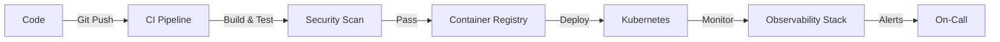

# 👋 Hi, I'm Araz Ghalamifard

## 🚀 DevOps Engineer | AWS | Kubernetes | Docker

I'm a passionate DevOps engineer specializing in cloud infrastructure, container orchestration, and CI/CD automation. I build reliable, scalable, and secure systems that enable teams to deliver value faster.

---

## 🛠️ Core Skills

### Cloud & Infrastructure

### Container & Orchestration

### CI/CD & Automation

### Programming & Scripting

### Monitoring & Observability

---

## 📊 Featured Projects

### 🐳 [Microservice K8s Demo](https://github.com/arazghf-star/microservice-k8s-demo)
Production-ready Python Flask microservice with Kubernetes deployment

**Tech Stack:** Python, Docker, Kubernetes, Helm, GitHub Actions  
**Highlights:**
- Multi-stage Dockerfile with security scanning (Trivy, Hadolint)
- Helm chart with HPA, PDB, NetworkPolicy
- Complete CI/CD pipeline with automated testing
- Smoke tests and E2E validation

---

### ☁️ [Terraform AWS Examples](https://github.com/arazghf-star/terraform-aws-examples)
Infrastructure as Code examples for AWS using LocalStack

**Tech Stack:** Terraform, LocalStack, tfsec, tflint  
**Highlights:**
- S3, DynamoDB, SQS, SNS, IAM configurations
- Automated validation and security scanning
- Cost optimization patterns
- Zero real AWS costs (LocalStack emulation)

---

### ⚡ [Serverless LocalStack Demo](https://github.com/arazghf-star/serverless-localstack-demo)
AWS Lambda REST API with SAM framework

**Tech Stack:** Python, AWS SAM, LocalStack, pytest  
**Highlights:**
- Lambda functions with API Gateway
- Unit and integration tests
- CI/CD with LocalStack deployment
- Production-ready patterns documented

---

### 🔄 [CI/CD Templates](https://github.com/arazghf-star/ci-cd-templates)
Reusable GitHub Actions workflows for DevOps pipelines

**Tech Stack:** GitHub Actions, Docker, Terraform, Helm  
**Highlights:**
- Docker build, scan, and multi-arch support
- Terraform validation and security checks
- Kubernetes manifest validation
- Secret scanning and policy enforcement

---

## 🏗️ Architecture Philosophy

**Key Principles:**
- 🔒 **Security First**: Every image scanned, every IaC validated
- 📊 **Observability**: Metrics, logs, traces from day one
- 🚀 **Automation**: If you do it twice, automate it
- 💰 **Cost Conscious**: Ephemeral environments, auto-cleanup
- 📚 **Documentation**: Code should be self-explanatory

---

## 📈 GitHub Stats

---

## 📫 Contact

- 💼 [LinkedIn](https://www.linkedin.com/in/araz-ghalamifard-45a98651/)
- 📧 Email: araz.ghf@gmail.com

---

## 💡 Currently Learning

- 🔄 GitOps with Argo CD and Flux
- 🔐 Service Mesh with Istio
- 📊 eBPF and advanced observability
- 🤖 Platform Engineering practices

---

**⚠️ Privacy Notice:** All projects in this portfolio are demo implementations using LocalStack and kind (local Kubernetes). No client data or production credentials are exposed. These projects demonstrate technical capabilities and best practices only.

---

  <i>Building reliable systems, one commit at a time.</i>

